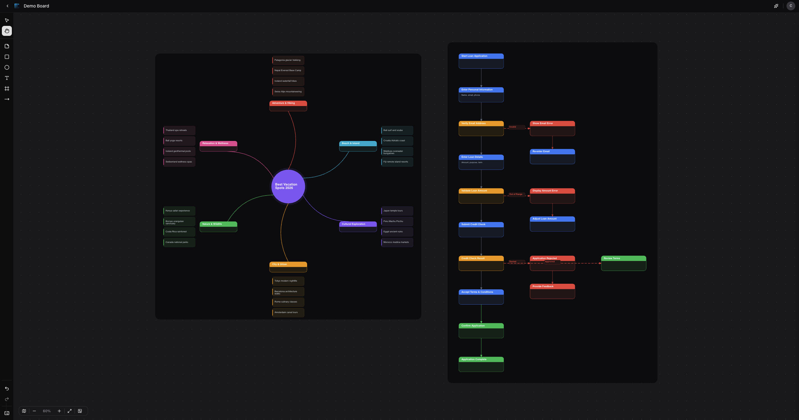

# cre8

Real-time collaborative whiteboard with AI agent integration. Multiple users create, move, and edit shapes on an infinite canvas while seeing each other's cursors and changes instantly. An AI agent manipulates the board through natural language commands.

**Live:** [cre8.cool](https://cre8.cool/) · [Try the demo](https://cre8.cool/demo) (no sign-up required)



## Features

- **Infinite canvas** — pan, zoom, 500+ objects at 60fps
- **7 object types** — sticky notes, rectangles, circles, text, lines, frames, connectors
- **Real-time multiplayer** — cursor sync, object sync, presence indicators
- **AI canvas agent** — 16 tool functions via Claude, natural language board manipulation
- **Repo architecture diagrams** — paste a GitHub URL, get a full architecture diagram laid out on canvas
- **Board management** — create, rename, duplicate, favorite, delete boards
- **Full editing** — multi-select, resize, rotate, copy/paste, undo/redo, keyboard shortcuts
- **Demo mode** — anonymous access, instant canvas with no sign-up
- **Dark/light mode** — theme toggle with oklch color system

## Tech Stack

| Layer | Technology |
|-------|-----------|
| Framework | Next.js 16, React 19, TypeScript |
| Canvas | react-konva / Konva |
| State | Zustand |
| Backend | Firebase Auth + Firestore + Realtime Database |
| AI | Anthropic Claude (Haiku + Sonnet) with function calling |
| Observability | Langfuse (AI tracing) |
| Styling | Tailwind CSS v4, shadcn/ui |
| Testing | Vitest (12 test files) |
| Deployment | Vercel |

## Architecture

```
User interaction (Konva) ──→ canvas-store ──→ Firestore
AI agent (tool use)      ──→ canvas-store ──→ Firestore
Repo analysis (Claude)   ──→ canvas-store ──→ Firestore
Firestore onSnapshot     ──→ canvas-store ──→ Konva re-render
```

- **Firestore** for board objects (last-write-wins conflict resolution)
- **Realtime Database** for cursors (30fps) and presence (`onDisconnect` cleanup)
- **Zustand** subscribe → diff → Firestore writes, with `isSyncingRef` to prevent loops

## Setup

```bash
git clone https://github.com/wkhori/cre8.git
cd cre8
npm install
```

Create `.env` with your Firebase + Anthropic keys:

```
NEXT_PUBLIC_FIREBASE_API_KEY=
NEXT_PUBLIC_FIREBASE_AUTH_DOMAIN=
NEXT_PUBLIC_FIREBASE_PROJECT_ID=
NEXT_PUBLIC_FIREBASE_STORAGE_BUCKET=
NEXT_PUBLIC_FIREBASE_MESSAGING_SENDER_ID=
NEXT_PUBLIC_FIREBASE_APP_ID=
NEXT_PUBLIC_FIREBASE_DATABASE_URL=
ANTHROPIC_API_KEY=
```

```bash
npm run dev      # Start dev server
npm run build    # Production build
npx vitest run   # Run tests
```

## AI Agent

Natural language commands via Claude function calling (16 tools). Examples:

```
"Add a yellow sticky note that says User Research"
"Create a SWOT analysis"
"Move all sticky notes to the right and change them to blue"
"Build a user journey map with 5 stages"
```

## Repo Architecture Diagrams

Paste a GitHub repo URL into the analyzer and get an architecture diagram generated on your canvas. Uses Repomix to pack the repo, Claude Sonnet to analyze the structure, and a deterministic layout engine to place components with connections. Results are cached in Firestore.

## Development

Built in 7 days. See the full build log at [/dev-process](https://cre8.cool/dev-process).
